## National University of Singapore (NUS)

## CP2106 (Orbital)

**Team ID:** 5548

**Team Members:**
1. Quah Han Rong, Glenn (Skylab ID: 5132)
2. Tan Zhi Wei (Skylab ID: 5133)

**Proposed Level of Achievement:** Apollo 11

**Difficulty Attempted:** Advanced

**Year:** 2023

## Table of content
- [Foreword by Developers](#foreword-by-developers)
- [Poster & Video](#poster--video)
- [Deployment](#deployment)
- [Motivation](#motivation)
- [Aim](#aim)
- [How are we different from Existing Platforms](#how-are-we-different-from-existing-platforms)
- [Tech Stack](#tech-stack)
- [User Stories](#user-stories)
- [Project Scope](#project-scope)
- [App Demo & Walkthrough](#app-demo--walkthrough)
- [System Design](#system-design)
- [Software Engineering Practices](#software-engineering-practices)
- [Testing](#testing)
- [Changes made through development](#changes-made-through-development)
- [Project Log](#project-log)
- [Sources & References](#sources--references)

# Foreword by Developers

Welcome to ConnectCard! This namecard application is designed to revolutionize the way you exchange and manage contact information.

As developers, we embarked on this journey with a simple yet powerful idea – to create a seamless and digital solution for sharing your professional identity. In today's fast-paced world, where networking and connections play a vital role, we recognized the need for a modern approach to exchanging contact details. 

Gone are the days where you carry around a physical namecard. With ConnectCard, you are able to showcase your unique brand and professional identity anytime and anywhere. By seamlessly scanning a QR Code, your namecard information can be exchanged easily.

We have poured our hearts and expertise into every aspect of this application, ensuring that it delivers a delightful user experience. Our focus on simplicity and intuitive design means that anyone, regardless of their technical proficiency, can effortlessly navigate and make the most of our application.

But our journey does not end here. We are committed to continuous improvement and evolution, guided by your valuable feedback and suggestions. Our passion for innovation and our dedication to providing a cutting-edge product drive us to push the boundaries of what this application can achieve.

So, without further ado, welcome to ConnectCard –** Networking made easy**

Regards,

Glenn Quah

Linkedln: [https://www.linkedin.com/in/glenn-quah-59390a18b/](https://www.linkedin.com/in/glenn-quah-59390a18b/)

Github: [https://github.com/glennquah](https://github.com/glennquah) 

Tan Zhi Wei

Linkedln: [https://www.linkedin.com/in/zhi-wei-tan-92b02525b/](https://www.linkedin.com/in/zhi-wei-tan-92b02525b/) 

Github: [https://github.com/ZhiWei1010](https://github.com/ZhiWei1010) 

# Poster & Video

## 2.1 Poster

## 2.2 LiftOff

Elevator Pitch Video: [https://drive.google.com/file/d/1KqCCN2fL1QiHnOnuNatBzYJn6tmiY9W4/view?usp=share_link](https://drive.google.com/file/d/1KqCCN2fL1QiHnOnuNatBzYJn6tmiY9W4/view?usp=share_link)

Poster: [https://drive.google.com/file/d/1Xfcv88yRIS-P9JojkY_17qMARUUyWp3c/view?usp=share_link](https://drive.google.com/file/d/1Xfcv88yRIS-P9JojkY_17qMARUUyWp3c/view?usp=share_link)

## 2.3 Milestone 1

Figma Design: [https://www.figma.com/file/hVvHnTKv5smJBOPmTPnpZP/Connect-Card?type=design&node-id=0%3A1&t=8YLkiicqGAFXCIrQ-1](https://www.figma.com/file/hVvHnTKv5smJBOPmTPnpZP/Connect-Card?type=design&node-id=0%3A1&t=8YLkiicqGAFXCIrQ-1)

Project Demo: [https://drive.google.com/file/d/1_FYtio2JPChTIyvzL8KLP-Jp_Hdezmzm/view?usp=sharing](https://drive.google.com/file/d/1_FYtio2JPChTIyvzL8KLP-Jp_Hdezmzm/view?usp=sharing)

Milestone 1 Prototype: [https://drive.google.com/file/d/1_FYtio2JPChTIyvzL8KLP-Jp_Hdezmzm/view?usp=sharing](https://drive.google.com/file/d/1_FYtio2JPChTIyvzL8KLP-Jp_Hdezmzm/view?usp=sharing)

## 2.4 Milestone 2

A1 Poster: [https://drive.google.com/file/d/1MQJMPrQ37ZrNrq_ALeu95r2SLRX-Vr9Z/view?usp=sharing](https://drive.google.com/file/d/1MQJMPrQ37ZrNrq_ALeu95r2SLRX-Vr9Z/view?usp=sharing)

Project Demo: [https://drive.google.com/file/d/1rrZD2IqqNtiWg3TsZ2e1fOy9HcUg8kcs/view?usp=sharing](https://drive.google.com/file/d/1rrZD2IqqNtiWg3TsZ2e1fOy9HcUg8kcs/view?usp=sharing)

App APK: [https://drive.google.com/drive/folders/1gHe2YpPyJYLERWdhZ95dpLA-nPWfbCxl](https://drive.google.com/drive/folders/1gHe2YpPyJYLERWdhZ95dpLA-nPWfbCxl)

## 2.5 Milestone 3

A1 Poster: [https://drive.google.com/file/d/1cfL-NQB0Ivjrkav68-N3gH1Q04b3ZxAS/view?usp=drive_link](https://drive.google.com/file/d/1cfL-NQB0Ivjrkav68-N3gH1Q04b3ZxAS/view?usp=drive_link) 

Project Demo: [https://drive.google.com/file/d/1bNgsbRKgLQ5-xu79HLYNc3w_j2NT44GG/view?usp=drive_link](https://drive.google.com/file/d/1bNgsbRKgLQ5-xu79HLYNc3w_j2NT44GG/view?usp=drive_link) 

App APK: [https://drive.google.com/drive/folders/1sdKgctwhZuty5yzFxVUUMiuW6nRoqbCH?usp=drive_link](https://drive.google.com/drive/folders/1sdKgctwhZuty5yzFxVUUMiuW6nRoqbCH?usp=drive_link) 

# Deployment

ConnectCard is currently only available on android. For users without an android device, you may download the app through an Android Emulator which can be downloaded from Android Studio. Otherwise, you may read the App Demo/Walkthrough or watch our App Demo Video which can be accessed under Poster & Video.

ConnectCard is packaged into an APK file, where you can download and install the APK on your android device directly.

Link to APK: [https://drive.google.com/drive/folders/1sdKgctwhZuty5yzFxVUUMiuW6nRoqbCH?usp=drive_link](https://drive.google.com/drive/folders/1sdKgctwhZuty5yzFxVUUMiuW6nRoqbCH?usp=drive_link) 

# Motivation

## 4.1 Problem:

Carrying physical name cards and membership/loyalty cards can be **burdensome**, leading to **lost contact information and a cluttered wallet**. It is **inconvenient** for individuals who meet new people, engage in business interactions, or collect various membership cards to **manage and access these cards efficiently.**

## 4.2 Solution:

ConnectCard provides a convenient solution by allowing users to scan physical name cards using their phone camera and convert them into digital cards stored within the application. Users can easily update their personal digital name cards, keeping their contact information up to date for seamless interactions. The application also enables users to add other users as friends easily by scanning a QR Code and sending the QR code through social media such as telegram and whatsapp. With our app, individuals can simplify their wallet, stay connected with ease, and take full advantage of membership benefits without the hassle of physical cards.

# Aim

The primary objective of our Orbital project is to develop a sophisticated mobile application that facilitates effortless storage and management of personal name cards, along with seamless user connectivity. Our ultimate vision is to eliminate the reliance on physical name cards and alleviate the inconvenience of carrying a bulky wallet through the streamlined functionality of this app. Designed for recruiters, professionals, job seekers, and everyone else. Simplify networking, all in one place.

# How are we different from Existing Platforms

## 6.1 Description

ConnectCard utilizes Firebase for data storage and manipulation, and Flutter for the user interface design. It offers various features such as scanning and storing name card information, linking the app to communication platforms like Telegram, Whatsapp, Phone, and Email, updating existing data, and QR Code technology for easy name card exchange.

## 6.2 Need:

Currently, there are existing name card applications that provide features such as storing and managing digital name cards of self and others. However, there are some few applications that satisfy some features that are important in a digital name card application.

Existing name card applications have limited functionality in these areas: \
- Converting current physical name cards into digital name cards easily \
- Sharing digital name cards with others easily

## 6.3 Key Technologies

### Optical Character Recognition (OCR)

ConnectCard utilizes OCR technology to extract text and relevant information from scanned name cards. This technology enables automatic data entry and ensures accurate digitization of the name card details.

### Image Processing

Image processing techniques are employed to enhance the scanned name card images, improve readability, and optimize the visual quality of the digitized cards. This helps in creating clear and professional-looking digital name cards.

### Mobile Camera Integration

ConnectCard seamlessly integrates with the mobile device's camera functionality, allowing users to capture images of physical name cards directly within the app. This integration simplifies the scanning process, making it convenient for users to convert physical cards into digital format effortlessly.

### Cloud Storage and Synchronization (Firebase)

To ensure data accessibility across multiple devices, our application integrates with cloud storage services. The digital name cards and associated data are securely stored in the cloud, enabling users to access and manage their cards from any device with the application installed. Synchronization functionality ensures that any updates made to the cards are reflected across all devices.

### QR Code Sharing

ConnectCard leverages QR code technology for the seamless exchange of digital name cards between users. Users can instantly add other users as friends by scanning their QR code, or even share their own personal QR code via social media such as telegram and whatsapp, fostering efficient networking and eliminating the need for manual contact input.

### Notes:

We decided to swap out the initially planned out NFC technology for the seamless exchange of digital name cards for QR Code Sharing. This is because QR Code is a widely used technology that users are used to using. Additionally, we are also using the camera for other functions such as the OCR to convert physical name cards into digital name cards, which means users would be more familiar with the scanning action with the camera, allowing easier familiarization of the app.

# Tech Stack

1. **Figma**: Prototyping and Frontend UI Design
2. **Flutter:** Frontend UI Framework
3. **Firebase: **Authentication & Database (Backend)

# User Stories

1. As a working adult, I want to be able to** sign up to have my own account, login and logout of the application.**
2. As a working adult, I want to be able to have a **profile page where I can upload my profile picture, name and headline.**
3. As a working adult, I want to be able to **get customer support easily.**
4. As a working adult, I want to be able to **create, edit and delete digital name cards** **easily.**
5. As a working adult, I want to be able to **connect with other users easily.**
6. As a working adult, I want to be able to **convert physical name cards into digital name cards easily.**
7. As a working adult, I want to be able to view the **scanned named cards easily.**

# Project Scope

## Milestone 1

1. **UI/UX of Application:** Finalized the design using FIGMA to be used as a template to guide
2. **Login / Registration:** By using an email & password to login

## Milestone 2

1. **Database:** The app uses Firebase as the backend database to store and manipulate data, ensuring efficient data management and retrieval.
2. **Updating existing Data:** Users have the flexibility to update their personal digital name cards at any time. This feature is especially useful when users experience changes in their job positions or roles within their existing company.
3. **Scanning Feature:** Users can use their device's camera to scan name cards and extract relevant information. Users cannot do anything with the extracted text just yet, but in Milestone 3, Users will be able to use the extracted information to create their own personal name cards or a friends’ name card.

## Milestone 3

1. **Friends system** The app uses Firebase as a backend database to store friend's card. Users can send, accept or reject friend requests.
2. **Communication Integration (QR Code):** The app allows users to add other users as friends seamlessly by scanning their personal QR code. The app is also integrated with popular communication platforms such as Telegram, Whatsapp, Phone, and Email, where they can send their personal QR code easily . This enables users to easily connect with their clients directly from the app.
3. **Scanning and storing feature (continuation from Milestone 2): **Users can now use the extracted text from the OCR feature to create new personal name cards or friend’s name cards which will be stored in the firebase.

# App Demo & Walkthrough

## Login Page
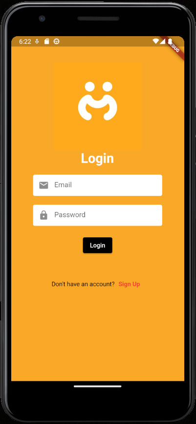

Allows users to log in to their ConnectCard account using their email and password.

Provides a toggle option to switch to the Registration page for new users.

## Registration Page
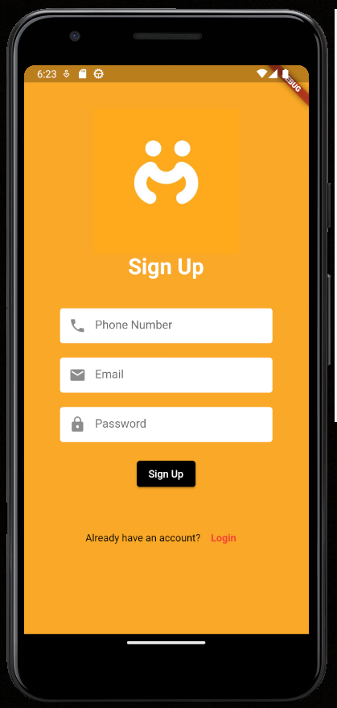

Allows new users to create a Connect Card account by providing their email and password.

Validates the user's email and password to ensure they meet the necessary requirements.

## Profile Page
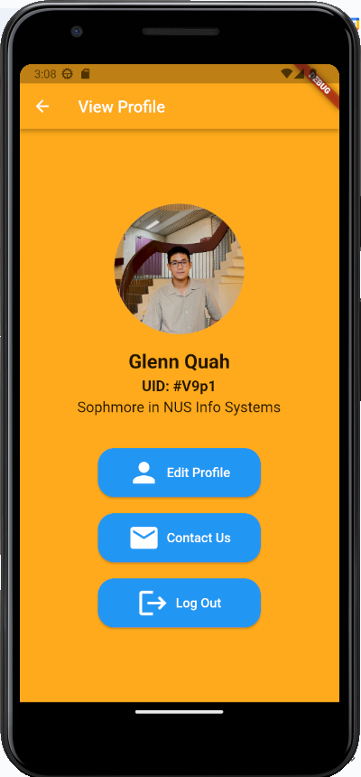

Allows users to select options such as editing profiles, contacting customer support, or logging out.

## Edit Profile Page
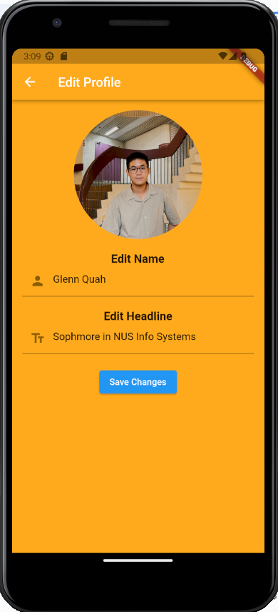

Allows users to edit their profile picture, name, and headline, which will be displayed when other users want to add them as friends. 

## Home Page
### Card View
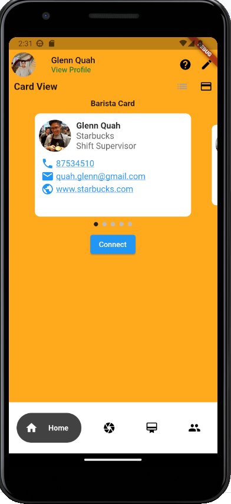
### List View
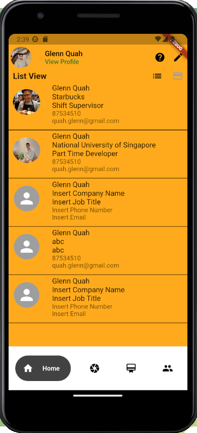

Displays a list or card view of the user's stored name cards, showing basic information such as name, organization, position, phone number, and email address for each card.

Includes a bottom navigation bar to access other pages.

Provides a profile bar at the top to access the user's profile page.

Provides a help icon at the top right for instructions on how to use the app.

Provides an edit icon at the top right, bringing them to the card editor form page.

## More Details Card Page
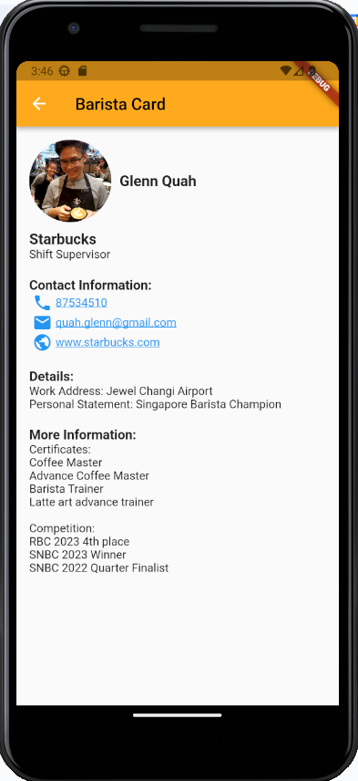

Users can view their cards in more detail by clicking on them.

## Card Editor Form Page
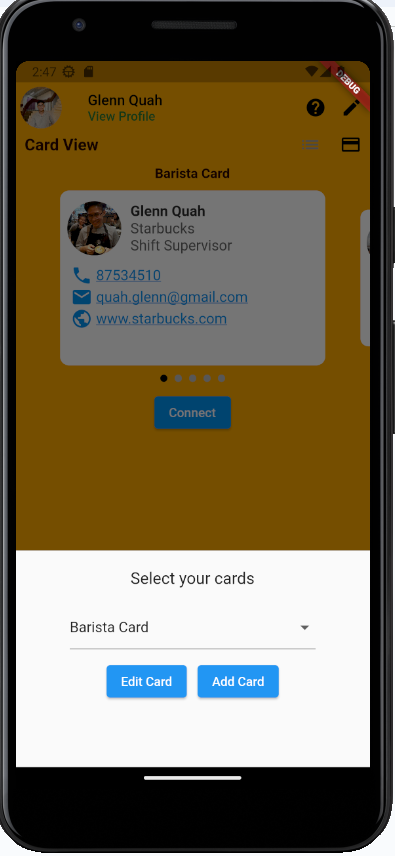

Allows users to add new name cards and edit the selected name cards.

Validates the entered information and displays error messages if required fields are not filled.

## Card Editor Page
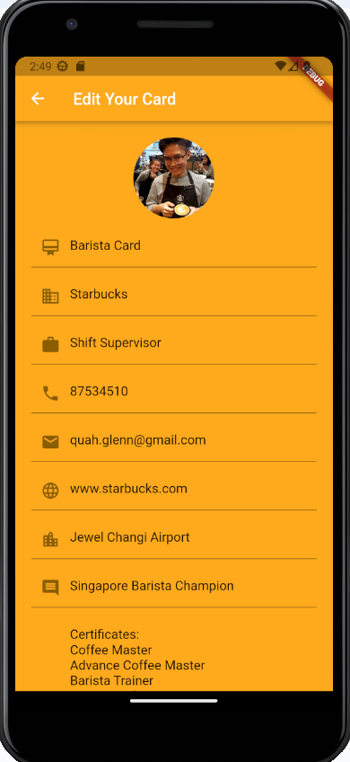

Loads the selected name card information from the database.

Allows users to add a display picture and update various information fields.

Provides an option to delete name cards, with a snack box appearing when attempting to delete the last card.

## Updated Data in Firebase
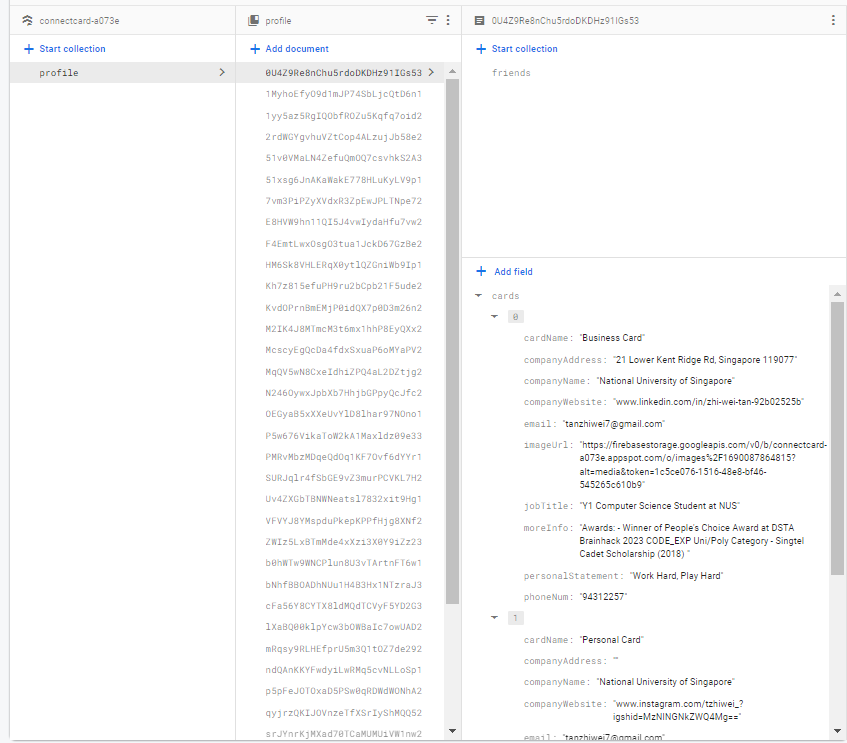

After editing the card details, it is automatically updated on Firebase.

When adding new cards, the List of Cards will add on

## Communication Integration
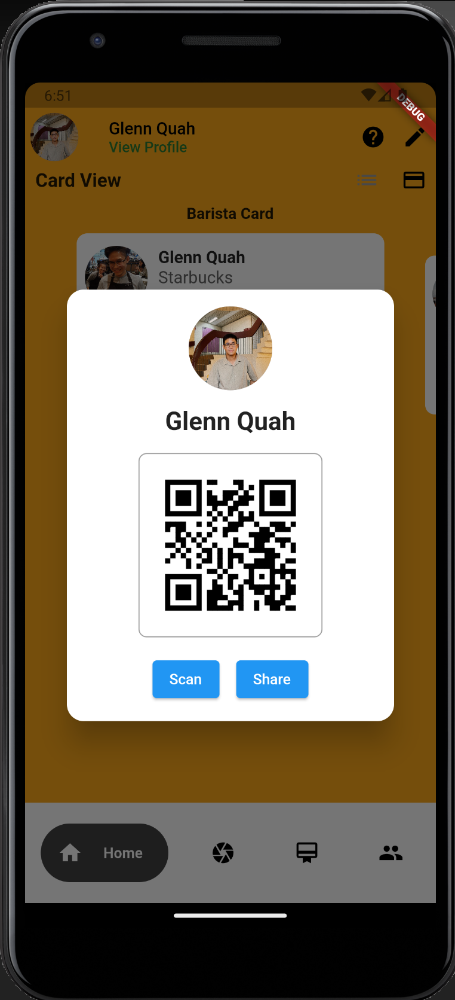

Each User will have their unique QR Code that can be accessed by clicking on the ‘connect’ button.

Users can choose to scan another user’s QR Code to them as a friend or send their QR code via social media

## Communication Integration (Adding friends by Scanning QR Code)
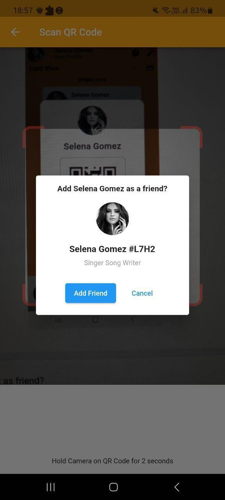

After users click the ‘Scan’ button, they can scan other user’s QR codes to add them as friend

## Communication Integration
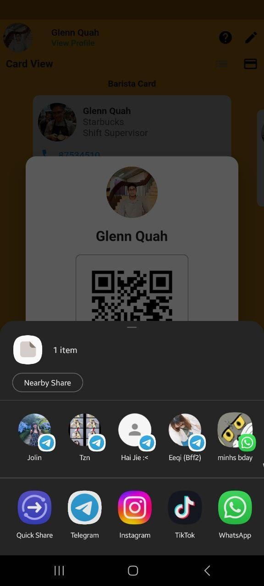
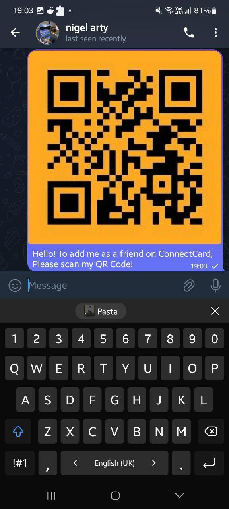

Users can also choose to click the ‘Share’ button to share their personal QR code with other users via social media

## Text Recog Page

Requests permission to use the camera for name card scanning.

Enables users to capture a photo of a name card.

Utilizes Google ML Kit and text recognition technology to convert the image into text and extract relevant information.

Users can click on the help icon at the top right for instructions on how to use this feature.
## Text Recog Results Page

Displays the results of the text conversion and extraction process.

Filters out Address, Email, and Website and prefills in the scanned card editor page.

When they click add card, an alert dialog appears and users can choose to add the scanned card as their own personal card or a friend’s card.

## Adding Scanned Cards

The phone number, email, website and address are prefilled automatically prefilled.

All other extracted text will be prefilled inside the more information area and users can cut and paste the information into the relevant fields.

### Personal

Users are able to select personal card and the card will be added into their list of cards

### Friend

Users are able to select friend card and the card will be added into the cards tab where they can view the information.

This allows users to digitalize their name card, having easy access whenever or wherever they are

## Scanned Card Page

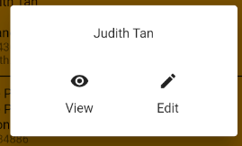

Users are able to view the list of scanned cards on the scanned card page.

A search function is also included for users to easily find the scanned card

Users will be able to edit or view the scanned card in more detail when they click on each card.

>>>>>  gd2md-html alert: inline image link here (to images/image24.png). Store image on your image server and adjust path/filename/extension if necessary.  (<a href="#">Back to top</a>)(<a href="#gdcalert25">Next alert</a>) >>>>> 

## View Scanned Card Page
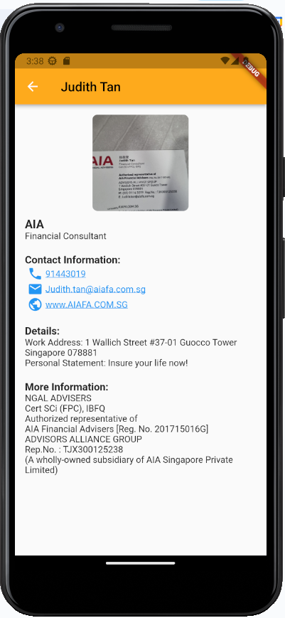

Users are able to view the scanned card with more detailed information after clicking on the card.

>>>>>  gd2md-html alert: inline image link here (to images/image25.png). Store image on your image server and adjust path/filename/extension if necessary.  (<a href="#">Back to top</a>)(<a href="#gdcalert26">Next alert</a>) >>>>> 

>>>>>  gd2md-html alert: inline image link here (to images/image26.png). Store image on your image server and adjust path/filename/extension if necessary.  (<a href="#">Back to top</a>)(<a href="#gdcalert27">Next alert</a>) >>>>> 

   </td>
   <td rowspan="2" ><strong>View Friends</strong>

Users list of friends will appear in the friends tab. User is able to press onto the list view to their friends cards

User can click into the card to view more information

>>>>>  gd2md-html alert: inline image link here (to images/image27.png). Store image on your image server and adjust path/filename/extension if necessary.  (<a href="#">Back to top</a>)(<a href="#gdcalert28">Next alert</a>) >>>>> 

   </td>
   <td><strong>Friend Request Received</strong>

When user receives a friend request, the friend request tab will turn red and indicate the number of request he has.

User can choose to accept or decline the request

After accepting the request, the person is now your friend and you are able to view their cards
   </td>
  </tr>
  <tr>
   <td>

>>>>>  gd2md-html alert: inline image link here (to images/image28.png). Store image on your image server and adjust path/filename/extension if necessary.  (<a href="#">Back to top</a>)(<a href="#gdcalert29">Next alert</a>) >>>>> 

>>>>>  gd2md-html alert: inline image link here (to images/image29.png). Store image on your image server and adjust path/filename/extension if necessary.  (<a href="#">Back to top</a>)(<a href="#gdcalert30">Next alert</a>) >>>>> 

   </td>
   <td><strong>Adding Friend</strong>

User is able to view the list of users using connect card, with the ability to search for their friend via their name, headline or UID.

After finding your friend, you can send them a friend request

You can view the request pending tab and you can see that the list of request pending
   </td>
  </tr>
</table>

# System Design

## 11.1 Application Flow

### Authentication

When the ConnectCard app is opened, it checks for persistent login information. If the user is already logged in, they are directed to the Home Page. Otherwise, they are brought to the Login Page to authenticate their credentials.

On the Login Page, users have the option to toggle between the Login and Register pages. After inputting the correct email and password values, the app authenticates these values with Firebase. If the email and password are correct, the user is directed to the Home Page. If the authentication fails, the user is given the opportunity to try again.

### View Profile

By pressing the top app bar button, the user is able to edit their profile, including their name, headline, and profile picture. Users can also click the "Contact Us" button to get in touch with customer service via email or phone or log out of the application.

### Card Editing

Users have the ability to edit their card information, add and delete new cards.

### Home Page

On the Home Page, users can view their existing cards in either a list or card view. The cards display basic information such as name, organization, position, phone number, and email address. By clicking on a card, they will be directed to another screen showing detailed information, with the ability to interact with the phone number, email, and website for communication.

### Connect

By clicking on the "Connect" button, the QR Code generator will be triggered, and a personalized QR Code will appear. Users can choose to scan other users' QR Codes to add them as friends or share them via social media, enabling others to connect with them.

### OCR Image to Text converter

The Scan Cards Page requires permission from the user to access the camera. Once permission is granted, users can take a photo of a name card. The app utilizes Google ML Kit and text recognition technology to convert the image into text, extracting relevant information from the name card. It filters the phone number, email address, website, and address. Users can choose to add the information as a personal card, which will be reflected in their list of cards, or as a friend's card, which will appear in the cards tab for easy reference. This allows users to digitize all their name cards, capturing them as pictures for convenient access in case of discrepancies.

### Card Tab

After scanning other users' physical name cards, the user can view or edit the following cards.

### Adding friend

By clicking on the blue button, users can easily search for friends as it displays the full list of users using ConnectCard. Additionally, they can search for friends through their UID, name, and headline. After finding their profile, users can send a friend request. Upon receiving a friend request, the friend request tab turns red, indicating the number of requests. Users are able to accept or decline the friend requests.

### Viewing friend cards

After the request is accepted, users can click on their friend's profile and look through their list of cards. The color of the card will be different to indicate that it belongs to the friend, not the user.

## 11.2 Class Relationship / Database ER Diagram

Every user document is split into 2 collection. “Friends” and “UserData”. This is to ensure security, easy access to specific data and to reduce impact on existing functionalities when updating user information.

### Enhanced Security

To separate sensitive data, ensuring that users only have access to the information they are authorized to see. This prevent potential security breaches and unauthorized access to sensitive ser relationship

### Easier access to specific Data

By having a dedicated “Friends” collection, it allows for efficient querying and retrieval of friend related information. When a user wants to retrieve their list of friends, accept or decline friend requests, or perform any action related to their friends, the system can directly access the "Friends" collection without needing to fetch unnecessary data from the "UserData" collection. This separation simplifies data retrieval and improves the overall performance of friend-related operations.

### Reduced impact on updates

When a user updates their profile information (e.g., name, headline, profile picture), having a separate "UserData" collection ensures that changes to user-specific data won't interfere with friend-related data. This separation minimizes the risk of accidental data corruption or inconsistencies. Additionally, it simplifies the process of updating user data without affecting friend connections or vice versa.

### Simplified User Management

Splitting data into logical collections can improve the management of user-related data. Administrators or developers can focus on specific tasks related to friends and friend requests without having to navigate through unrelated user data. This compartmentalization streamlines maintenance and development processes.

## 11.3 Software Architecture

# Software Engineering Practices

Here are some of the software engineering practices that we used for our Orbital project.

## Project Management with GitHub Projects

### Github Milestones

When embarking on a new feature, we establish dedicated milestones that align with the overarching project goals. Each milestone serves as a crucial stepping stone towards the successful completion of the feature, ensuring that our efforts are focused and well-organized.

### Issues

As part of our milestone-driven development process, we leverage Git issues to effectively manage and track the progress of our work. Once we have established milestones, we break down feature development into smaller, manageable tasks and create Git issues to encapsulate them. This granular breakdown enables us to focus on specific aspects of the feature, promoting efficiency and collaboration among team members. Moreover, we will delegate the tasks, apply labels for easy categorization, and assign them to our project for efficient project management.

### Labels

By using Git labels, after creating each issue, we will apply different labels to categorize it based on its content. This will help us easily understand what each issue is about and organize them accordingly.

### Work allocation

By utilizing a Git project spreadsheet, we can have an overview of the work allocation. All the issues are listed down as tasks, and we can track the status of each task. This provides a clear picture of how the work is distributed among team members and helps us monitor progress efficiently. The spreadsheet allows us to keep track of completed tasks, ongoing work, and pending items, ensuring that the project stays on track and all team members are aligned with their assigned tasks.

## 12.2 Version Control

### Branching

By utilizing the branching feature in Git, we ensure a structured and organized development process. Whenever we work on a new feature or bug fix, we create a separate branch for it. This approach allows multiple team members to work on different features concurrently without causing conflicts or discrepancies in the codebase.

Each branch represents a specific task or feature, which helps us maintain code isolation and makes it easier to review and test changes independently. Once the feature is completed or the bug is fixed, we thoroughly test the code to ensure its functionality and reliability.

Only after testing and verification, we proceed with creating a pull request to merge the branch into the main branch. By following this branching workflow, we minimize the risk of introducing bugs and maintain a stable main branch that represents the most up-to-date and tested version of the project. It promotes collaboration, transparency, and effective code management throughout the development process.

### Pull request

We follow a structured approach by first testing our branches thoroughly. Instead of directly updating the main branch, we utilize Git pull requests. This enables others to review the code and helps prevent any discrepancies before merging. This collaborative process ensures code quality and maintains a stable main branch.

### Releases / Tags

By creating releases and tagging them with version numbers via milestones, it becomes easy to track and manage different versions of the software. This helps in keeping a clear record of each release and allows us to revert to specific versions if needed.

# Testing

For testing, we have split it into 2, automated testing and user testing.

1. Automated TestingUnit test: To test a single function, method or class
2. Integration test: to test the complete app or a large part of the app
3. User Testing
* Scenario based testing: design test scenarios that replicate real-world situation that users might encounter
* Diverse user representation: including different demographics, skill levels and backgrounds
* Bug reporting and tracking: provide a simple and clear way for users to report bus and issues through a google  form

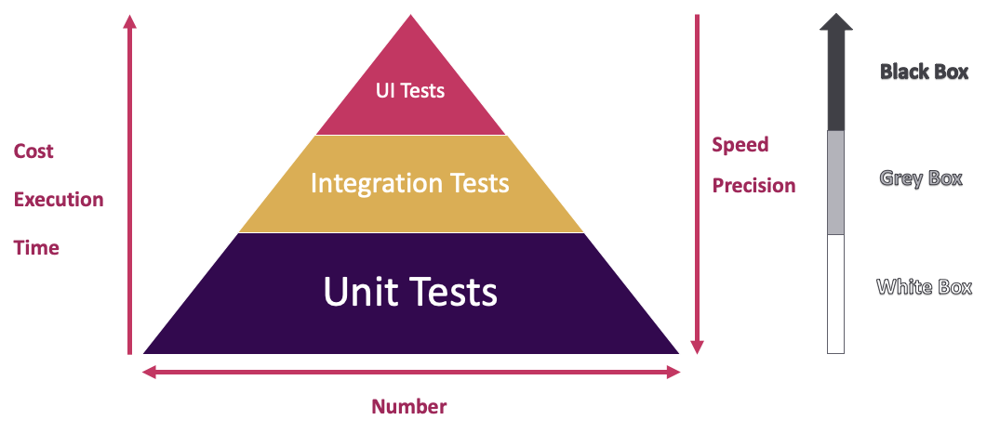

## Screenshots of Google Responses
Please visit this link to view more information on our Google survey form responses.
Link: https://docs.google.com/document/d/1GVsOisbiYp4yAPMlSFgj1nU5VWP4nFaO/view#bookmark=id.d6e3y2etbxv

# Changes made through development

<table>
  <tr>
   <td><strong>ID</strong>
   </td>
   <td><strong>Before</strong>
   </td>
   <td><strong>After</strong>
   </td>
   <td><strong>Reason</strong>
   </td>
  </tr>
  <tr>
   <td>1
   </td>
   <td>Store and access membership or loyalty reward cards digitally, eliminating the reliance on physical cards.
   </td>
   <td>Remove the digital membership loyalty rewards card feature.
   </td>
   <td>We decided to narrow our focus down to name cards, sticking by our vision ‘networking made easy’.
   </td>
  </tr>
  <tr>
   <td>2
   </td>
   <td>Exchange and share personal name cards through NFC integration
   </td>
   <td>Add friends through QR Code Scanning, thereafter users can view all of the friends’ cards.
   </td>
   <td>QR Code is a widely used technology that users are used to using. Additionally, we are also using the camera for other functions such as the OCR to convert physical name cards into digital name cards, which means users would be more familiar with the scanning action with the camera, allowing easier familiarization of the app.
   </td>
  </tr>
  <tr>
   <td>3
   </td>
   <td>No segregation of sub collections in firebase.
   </td>
   <td>create a sub collection named ‘friends’ to segregate all the friends’ data and friends name card
   </td>
   <td>When updating the firebase for the different collections, only 1 collection needs to be updated instead of the entire database under a document.
   </td>
  </tr>
  <tr>
   <td>4
   </td>
   <td>Converting physical name cards into personal name cards only
   </td>
   <td>Converting physical name cards into both <strong>personal & friend’s cards.</strong>
   </td>
   <td>Not everyone will have a ConnectCard account. For example, businesses such as Dental clinics and salons also carry their own name cards. Therefore, by including a friend’s card option for the conversion of the physical cards, users can now save these name cards easily.
   </td>
  </tr>
  <tr>
   <td>5
   </td>
   <td>Friends can be added immediately with no friend request function
   </td>
   <td>Friend request system is set up. Users will have to accept and
   </td>
   <td>Friend request system allows user to have more privacy and control over who they want their name cards to be shared with.
   </td>
  </tr>
</table>

# Project Log

Link: [https://docs.google.com/spreadsheets/d/1aPRcCrV2DgaXbIsEnaVfjLGABb_CIqXqBk_hmSb5DgI/edit?usp=sharing](https://docs.google.com/spreadsheets/d/1aPRcCrV2DgaXbIsEnaVfjLGABb_CIqXqBk_hmSb5DgI/edit?usp=sharing)

# Sources & References

1. [https://www.youtube.com/watch?v=1ukSR1GRtMU&list=PL4cUxeGkcC9jLYyp2Aoh6hcWuxFDX6PBJ](https://www.youtube.com/watch?v=1ukSR1GRtMU&list=PL4cUxeGkcC9jLYyp2Aoh6hcWuxFDX6PBJ)
2. [https://www.youtube.com/watch?v=sfA3NWDBPZ4&list=PL4cUxeGkcC9j--TKIdkb3ISfRbJeJYQwC](https://www.youtube.com/watch?v=sfA3NWDBPZ4&list=PL4cUxeGkcC9j--TKIdkb3ISfRbJeJYQwC)
3. [https://docs.github.com/en/issues/using-labels-and-milestones-to-track-work/managing-labels](https://docs.github.com/en/issues/using-labels-and-milestones-to-track-work/managing-labels)
4. [https://docs.github.com/en/organizations/managing-organization-settings/managing-default-labels-for-repositories-in-your-organization](https://docs.github.com/en/organizations/managing-organization-settings/managing-default-labels-for-repositories-in-your-organization)
5. [https://docs.github.com/en/rest/issues/assignees?apiVersion=2022-11-28](https://docs.github.com/en/rest/issues/assignees?apiVersion=2022-11-28)
6. [https://docs.github.com/en/rest/git/tags?apiVersion=2022-11-28](https://docs.github.com/en/rest/git/tags?apiVersion=2022-11-28)
7. [https://docs.github.com/en/actions/managing-issues-and-pull-requests/adding-labels-to-issues](https://docs.github.com/en/actions/managing-issues-and-pull-requests/adding-labels-to-issues)
8. [https://pub.dev/packages/google_nav_bar](https://pub.dev/packages/google_nav_bar)
9. [https://www.youtube.com/watch?v=Uw0T4ZIgFgs](https://www.youtube.com/watch?v=Uw0T4ZIgFgs)
10. [https://davidserrano.io/text-recognition-in-flutter-create-ocr-scanner-app](https://davidserrano.io/text-recognition-in-flutter-create-ocr-scanner-app)
11. [https://pub.dev/packages/google_mlkit_text_recognition](https://pub.dev/packages/google_mlkit_text_recognition)
12. [https://pub.dev/packages/permission_handler](https://pub.dev/packages/permission_handler)
13. [https://api.flutter.dev/flutter/widgets/FutureBuilder-class.html](https://api.flutter.dev/flutter/widgets/FutureBuilder-class.html)
14. [https://pub.dev/packages/camera](https://pub.dev/packages/camera)
15. [https://medium.flutterdevs.com/nfc-in-flutter-43e419f48b47](https://medium.flutterdevs.com/nfc-in-flutter-43e419f48b47)
16. [https://pub.dev/packages/nfc_manager](https://pub.dev/packages/nfc_manager)
17. [https://pub.dev/packages/showcaseview](https://pub.dev/packages/showcaseview)
18. [https://resocoder.com/2021/08/03/flutter-showcaseview-tutorial-introduce-app-features-to-your-users/](https://resocoder.com/2021/08/03/flutter-showcaseview-tutorial-introduce-app-features-to-your-users/)
19. [https://docs.flutter.dev/cookbook/testing/unit/introduction](https://docs.flutter.dev/cookbook/testing/unit/introduction)
20. [https://medium.com/@a.poichet/flutter-and-the-practical-test-pyramid-with-the-bloc-pattern-6e6bf10dda9d](https://medium.com/@a.poichet/flutter-and-the-practical-test-pyramid-with-the-bloc-pattern-6e6bf10dda9d) 
21. [https://www.youtube.com/watch?v=GuGdIg4iH_k](https://www.youtube.com/watch?v=GuGdIg4iH_k)
22. [https://www.youtube.com/watch?v=jSaoTC1ULB8](https://www.youtube.com/watch?v=jSaoTC1ULB8)
23. [https://www.youtube.com/watch?v=TQhMCFGaIOQ&t=2712s&ab_channel=SYLVAINTAIO](https://www.youtube.com/watch?v=TQhMCFGaIOQ&t=2712s&ab_channel=SYLVAINTAIO)
24. [https://www.youtube.com/watch?v=RwsDVQFrH2o&ab_channel=QRTIGER-QRCodeGenerator](https://www.youtube.com/watch?v=RwsDVQFrH2o&ab_channel=QRTIGER-QRCodeGenerator)
25. [https://www.youtube.com/watch?v=tGSWzsxJCsA&ab_channel=BaabaDevs](https://www.youtube.com/watch?v=tGSWzsxJCsA&ab_channel=BaabaDevs)
26. [https://www.youtube.com/watch?v=WTSPwr0vJmM&t=792s&ab_channel=JensTofte](https://www.youtube.com/watch?v=WTSPwr0vJmM&t=792s&ab_channel=JensTofte)
27. [https://www.youtube.com/watch?v=o1XuW6DKkEs&t=530s&ab_channel=SujanBhattarai](https://www.youtube.com/watch?v=o1XuW6DKkEs&t=530s&ab_channel=SujanBhattarai)
28. [https://www.youtube.com/watch?v=11OoD1rhV9I&ab_channel=ChidiebereEdeh](https://www.youtube.com/watch?v=11OoD1rhV9I&ab_channel=ChidiebereEdeh)
29. [https://www.youtube.com/watch?v=4YxGA3OC0c4&t=341s&ab_channel=TheTechBrothers](https://www.youtube.com/watch?v=4YxGA3OC0c4&t=341s&ab_channel=TheTechBrothers)
30. [https://www.youtube.com/watch?v=N8x63LJlpD0&ab_channel=dbestech](https://www.youtube.com/watch?v=N8x63LJlpD0&ab_channel=dbestech)
31. [https://www.youtube.com/watch?v=7Z2Wqm8waSM&t=952s&ab_channel=DevMo](https://www.youtube.com/watch?v=7Z2Wqm8waSM&t=952s&ab_channel=DevMo)
32. [https://www.youtube.com/watch?v=haMOUb3KVSo&ab_channel=Firebase](https://www.youtube.com/watch?v=haMOUb3KVSo&ab_channel=Firebase)
33. [https://www.youtube.com/watch?v=S-8v9nOCUfw&t=27s&ab_channel=TrueCoders](https://www.youtube.com/watch?v=S-8v9nOCUfw&t=27s&ab_channel=TrueCoders)
34. [https://www.youtube.com/watch?v=QyChOayFQDk&ab_channel=CodingCafe](https://www.youtube.com/watch?v=QyChOayFQDk&ab_channel=CodingCafe)
35. [https://www.youtube.com/watch?v=P6OTh-5NDN4&ab_channel=HMTutorials](https://www.youtube.com/watch?v=P6OTh-5NDN4&ab_channel=HMTutorials)
36. [https://www.youtube.com/watch?v=LlQimtjqZ9A&ab_channel=CodingWithTea](https://www.youtube.com/watch?v=LlQimtjqZ9A&ab_channel=CodingWithTea)
37. [https://www.youtube.com/watch?v=F_OUGeNyiMk&t=6s&ab_channel=TechnicalSkillz](https://www.youtube.com/watch?v=F_OUGeNyiMk&t=6s&ab_channel=TechnicalSkillz)
38. Special mention to Ruby our orbital advisor for comments, feedback and guidance!
